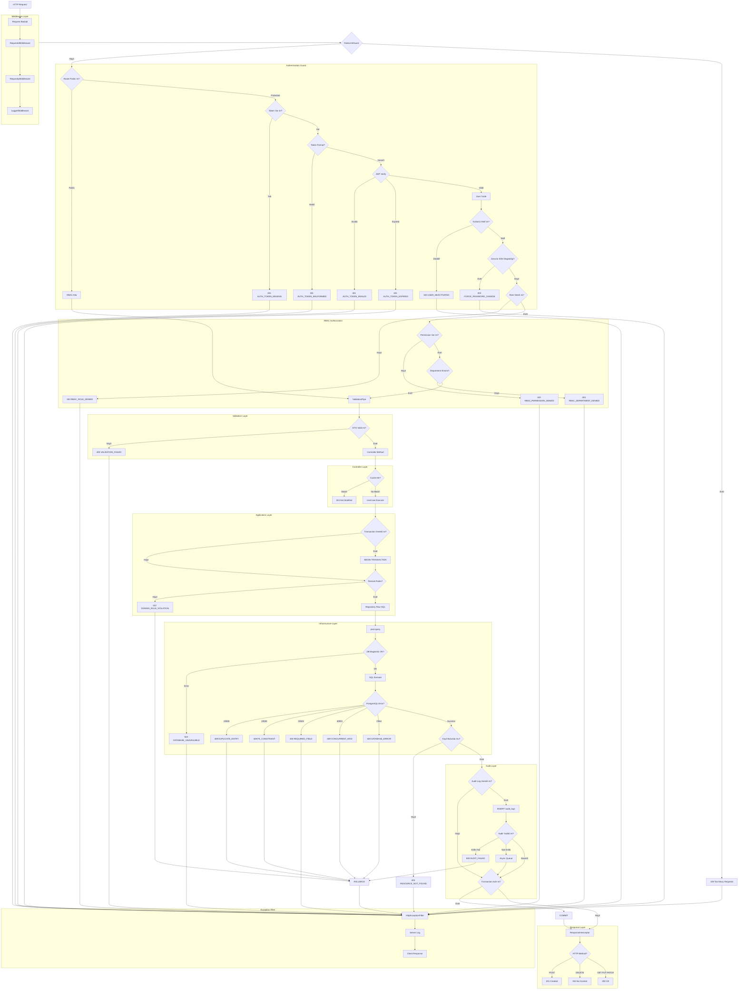
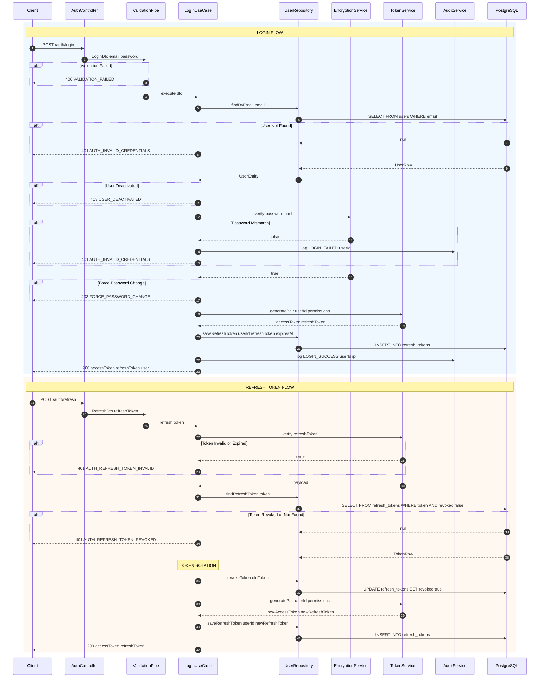
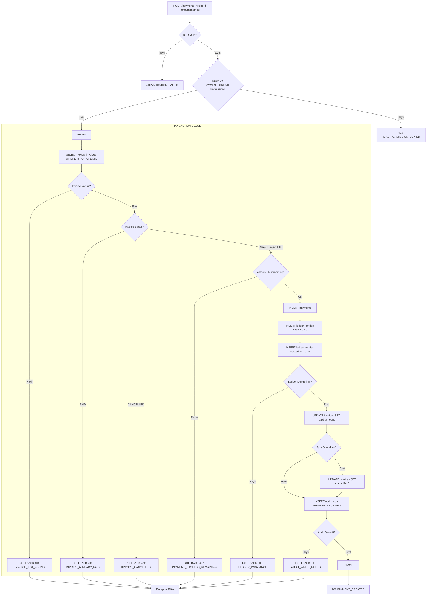
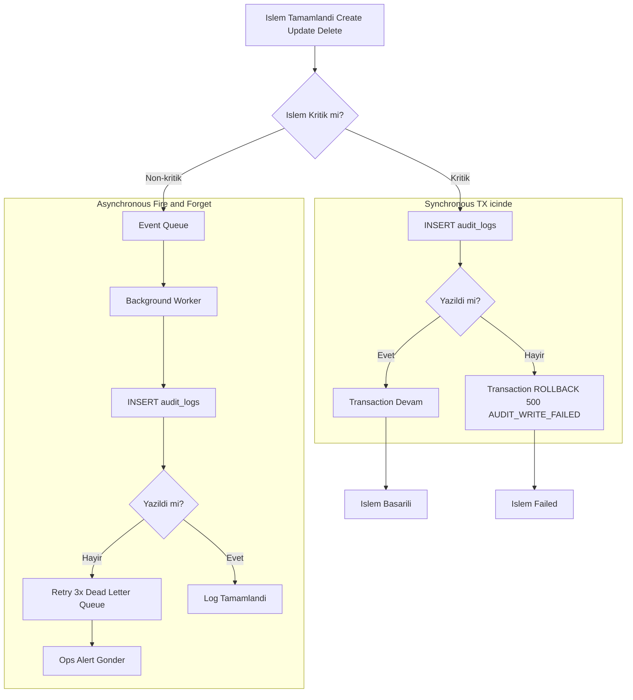

# Trivexa Backend - Kapsamli Mimari Akis Semasi

> **Proje**: Trivexa Ajans Yonetim Sistemi Backend  
> **Framework**: NestJS  
> **Database**: PostgreSQL (pg - raw SQL, ORM yok)  

---

# BOLUM A: GENEL REQUEST PIPELINE

## 1. Ana Akis Semasi



---

# BOLUM B: ALT AKISLAR

## 2. Auth Login ve Refresh Token Akisi



---

## 3. Accounting Transaction Akisi - Invoice Odeme



---

## 4. Audit Log Yazim Akisi



---

# BOLUM C: RESPONSE ENVELOPE STANDARDI

## 5. JSON Response Envelope Semasi

```typescript
interface ApiResponse<T> {
  requestId: string;
  timestamp: string;
  path: string;
  method: string;
  statusCode: number;
  success: boolean;
  message: string;
  code?: string;
  data?: T;
  details?: any;
  meta?: {
    total?: number;
    page?: number;
    limit?: number;
    cacheHit?: boolean;
    etag?: string;
  };
}
```

---

## 6. Ornek JSON Responselar

### 200 OK - Basarili Liste

```json
{
  "requestId": "req_abc123",
  "timestamp": "2026-01-25T19:15:00.000Z",
  "path": "/api/v1/users",
  "method": "GET",
  "statusCode": 200,
  "success": true,
  "message": "Kullanicilar basariyla listelendi",
  "data": [
    {"id": "uuid-1", "email": "admin@trivexa.com", "name": "Admin"},
    {"id": "uuid-2", "email": "user@trivexa.com", "name": "User"}
  ],
  "meta": {
    "total": 42,
    "page": 1,
    "limit": 20
  }
}
```

### 201 Created - Kayit Olusturuldu

```json
{
  "requestId": "req_def456",
  "timestamp": "2026-01-25T19:16:00.000Z",
  "path": "/api/v1/invoices",
  "method": "POST",
  "statusCode": 201,
  "success": true,
  "message": "Fatura basariyla olusturuldu",
  "data": {
    "id": "inv_uuid-123",
    "invoiceNumber": "TRV-2026-0001",
    "total": 5000.00,
    "status": "DRAFT"
  }
}
```

### 400 Bad Request - Validation Hatasi

```json
{
  "requestId": "req_ghi789",
  "timestamp": "2026-01-25T19:17:00.000Z",
  "path": "/api/v1/users",
  "method": "POST",
  "statusCode": 400,
  "success": false,
  "message": "Gonderilen veriler gecersiz",
  "code": "VALIDATION_FAILED",
  "details": [
    {"field": "email", "message": "Gecerli bir email adresi giriniz"},
    {"field": "password", "message": "Sifre en az 8 karakter olmalidir"},
    {"field": "phone", "message": "Telefon numarasi formati hatali"}
  ]
}
```

### 401 Unauthorized - Token Hatasi

```json
{
  "requestId": "req_jkl012",
  "timestamp": "2026-01-25T19:18:00.000Z",
  "path": "/api/v1/projects",
  "method": "GET",
  "statusCode": 401,
  "success": false,
  "message": "Oturum sureniz dolmus lutfen tekrar giris yapin",
  "code": "AUTH_TOKEN_EXPIRED"
}
```

### 403 Forbidden - Yetki Hatasi

```json
{
  "requestId": "req_mno345",
  "timestamp": "2026-01-25T19:19:00.000Z",
  "path": "/api/v1/accounting/ledger",
  "method": "POST",
  "statusCode": 403,
  "success": false,
  "message": "Bu islem icin yetkiniz bulunmamaktadir",
  "code": "RBAC_PERMISSION_DENIED",
  "details": {
    "required": "ACCOUNTING_LEDGER_WRITE",
    "userPermissions": ["PROJECT_VIEW", "TICKET_CREATE"]
  }
}
```

### 404 Not Found - Kayit Bulunamadi

```json
{
  "requestId": "req_pqr678",
  "timestamp": "2026-01-25T19:20:00.000Z",
  "path": "/api/v1/clients/uuid-999",
  "method": "GET",
  "statusCode": 404,
  "success": false,
  "message": "Istenen musteri kaydi bulunamadi",
  "code": "RESOURCE_NOT_FOUND",
  "details": {
    "resource": "Client",
    "id": "uuid-999"
  }
}
```

### 409 Conflict - Cakisma

```json
{
  "requestId": "req_stu901",
  "timestamp": "2026-01-25T19:21:00.000Z",
  "path": "/api/v1/users",
  "method": "POST",
  "statusCode": 409,
  "success": false,
  "message": "Bu email adresi zaten kayitli",
  "code": "DUPLICATE_ENTRY",
  "details": {
    "field": "email",
    "value": "existing@trivexa.com"
  }
}
```

### 422 Unprocessable - Is Kurali Ihlali

```json
{
  "requestId": "req_vwx234",
  "timestamp": "2026-01-25T19:22:00.000Z",
  "path": "/api/v1/payments",
  "method": "POST",
  "statusCode": 422,
  "success": false,
  "message": "Odeme tutari kalan borctan fazla olamaz",
  "code": "DOMAIN_RULE_VIOLATION",
  "details": {
    "rule": "PAYMENT_EXCEEDS_REMAINING",
    "invoiceId": "inv_uuid-123",
    "remainingAmount": 1500.00,
    "attemptedAmount": 2000.00
  }
}
```

### 429 Too Many Requests - Rate Limit

```json
{
  "requestId": "req_yza567",
  "timestamp": "2026-01-25T19:23:00.000Z",
  "path": "/api/v1/auth/login",
  "method": "POST",
  "statusCode": 429,
  "success": false,
  "message": "Cok fazla istek gonderdiniz lutfen bekleyin",
  "code": "RATE_LIMIT_EXCEEDED",
  "details": {
    "retryAfter": 60,
    "limit": "10 requests per minute"
  }
}
```

### 500 Internal Server Error

```json
{
  "requestId": "req_bcd890",
  "timestamp": "2026-01-25T19:24:00.000Z",
  "path": "/api/v1/reports/cashflow",
  "method": "GET",
  "statusCode": 500,
  "success": false,
  "message": "Beklenmeyen bir hata olustu lutfen daha sonra tekrar deneyin",
  "code": "INTERNAL_ERROR",
  "details": {
    "support": "Bu hata devam ederse destek@trivexa.com adresine basvurun",
    "errorRef": "req_bcd890"
  }
}
```

### 503 Service Unavailable

```json
{
  "requestId": "req_efg123",
  "timestamp": "2026-01-25T19:25:00.000Z",
  "path": "/api/v1/users",
  "method": "GET",
  "statusCode": 503,
  "success": false,
  "message": "Servis gecici olarak kullanilamiyor lutfen birkac dakika sonra tekrar deneyin",
  "code": "DATABASE_UNAVAILABLE",
  "details": {
    "retryAfter": 30
  }
}
```

---

# BOLUM D: HATA YONETIMI

## 7. Hata Mesaji Stratejisi

| Seviye | Hedef | Icerik | Ornek |
|--------|-------|--------|-------|
| message | Frontend Son Kullanici | Kisa anlasilir aksiyon odakli | Oturum sureniz dolmus lutfen tekrar giris yapin |
| details | Developer Debug | Field errors stack trace | field email constraint unique pgCode 23505 |

---

# BOLUM E: POSTGRESQL HATA MAPPING TABLOSU

## 8. pg Error Code HTTP Status Mapping

| PostgreSQL Code | PostgreSQL Name | HTTP Status | Frontend Code | Aciklama |
|-----------------|-----------------|-------------|---------------|----------|
| 23505 | unique_violation | 409 | DUPLICATE_ENTRY | Email invoice_number vb unique constraint ihlali |
| 23503 | foreign_key_violation | 409 | FK_CONSTRAINT_FAILED | Var olmayan parent kaydina referans |
| 23502 | not_null_violation | 400 | REQUIRED_FIELD_MISSING | NULL olamaz alan bos gonderilmis |
| 23514 | check_violation | 422 | CHECK_CONSTRAINT_FAILED | CHECK constraint ihlali |
| 40001 | serialization_failure | 409 | CONCURRENT_MODIFICATION | Concurrent transaction cakismasi |
| 40P01 | deadlock_detected | 409 | DEADLOCK_DETECTED | Deadlock Client retry yapmali |
| 08000-08999 | connection_exception | 503 | DATABASE_UNAVAILABLE | DB baglanti hatasi |
| 57P01 | admin_shutdown | 503 | DATABASE_SHUTDOWN | DB bakimda |
| XX000 | internal_error | 500 | DATABASE_INTERNAL | Beklenmeyen DB hatasi |

---

# BOLUM F: ADIM ADIM ACIKLAMA

## 9. Request Pipeline Adimlari

### Adim 1: HTTP Request Alimi
1. Client HTTP istegi gonderir GET POST PUT DELETE
2. NestJS istegi karsilar

### Adim 2: Middleware Zinciri
1. RequestIdMiddleware Unique X-Request-Id uretir veya headerdan alir
2. RequestIpMiddleware X-Forwarded-For veya socket IPden client IP cikarir
3. LoggerMiddleware Method path user-agent loglar

### Adim 3: Rate Limit Guard
1. IP ve endpoint bazli rate limit kontrolu
2. Redis Memory de sayac kontrol
3. Limit asilirsa 429 RATE_LIMIT_EXCEEDED

### Adim 4: JWT Auth Guard
1. Public route ise atla
2. Authorization header kontrolu yoksa 401 AUTH_TOKEN_MISSING
3. Bearer format kontrolu hataliysa 401 AUTH_TOKEN_MALFORMED
4. JWT verify signature ve expiry invalid 401 AUTH_TOKEN_INVALID expired 401 AUTH_TOKEN_EXPIRED
5. Useri DBden yukle permissions attach et
6. User aktif degilse 403 USER_DEACTIVATED
7. Force password change aktifse 403 FORCE_PASSWORD_CHANGE

### Adim 5: RBAC Guard
1. Endpointin gerektirdigi role kontrolu yetersiz 403 RBAC_ROLE_DENIED
2. Endpointin gerektirdigi permission kontrolu yetersiz 403 RBAC_PERMISSION_DENIED
3. Department-scoped resource ise department kontrolu yetersiz 403 RBAC_DEPARTMENT_DENIED

### Adim 6: Validation Pipe
1. Request bodyyi DTO classa transform et
2. class-validator ile validate et
3. Validation failed 400 VALIDATION_FAILED field errors

### Adim 7: Controller
1. ETag If-None-Match varsa cache hit kontrolu match 304 Not Modified
2. UseCasei cagir

### Adim 8: UseCase Application Layer
1. Transaction gerekli mi kontrolu
2. Gerekli ise BEGIN
3. Domain rules kontrolu ihlal 422 DOMAIN_RULE_VIOLATION
4. Repository call

### Adim 9: Repository Infrastructure Layer
1. pool.query ile SQL calistir
2. Connection error 503 DATABASE_UNAVAILABLE
3. PostgreSQL error mappinge gore 409 400 422 500
4. Kayit bulunamadi 404 RESOURCE_NOT_FOUND

### Adim 10: Audit Log
1. Kritik islem mi kontrol
2. Kritik ise sync TX icinde INSERT basarisiz ise 500 AUDIT_WRITE_FAILED ROLLBACK
3. Non-kritik ise async queueya at

### Adim 11: Transaction Sonucu
1. Tum adimlar basarili COMMIT
2. Herhangi bir hata ROLLBACK

### Adim 12: Response Interceptor
1. Basarili responseu envelopea sar
2. POST 201 DELETE deactivate 204 diger 200

### Adim 13: Exception Filter Hata Durumunda
1. Exception yakala
2. Server log full stack requestId
3. Client response masked in prod
4. Standart error envelope dondur

---

# BOLUM G: AUDIT LOG KARARI

## 10. Kritik vs Non-Kritik Islemler

| Islem Tipi | Audit Modu | Basarisizlik Davranisi |
|------------|------------|------------------------|
| LOGIN LOGOUT | Sync | TX fail 500 dondur |
| PAYMENT_CREATE | Sync | TX fail 500 dondur |
| USER_DELETE | Sync | TX fail 500 dondur |
| PERMISSION_CHANGE | Sync | TX fail 500 dondur |
| PROJECT_UPDATE | Async | Log to queue continue |
| TICKET_COMMENT | Async | Log to queue continue |
| TIME_ENTRY_START | Async | Log to queue continue |

Karar: Kritik islemler auth payment delete permission icin audit yazilamamasi durumunda islem fail edilir veri tutarliligi. Non-kritik islemler icin async queue kullanilir ve retry mekanizmasi devrededir.
