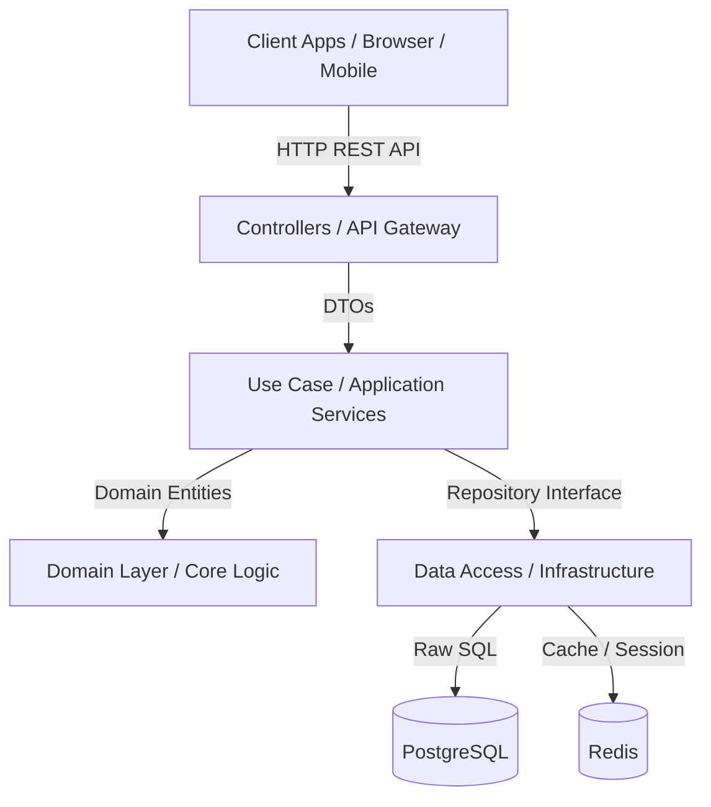
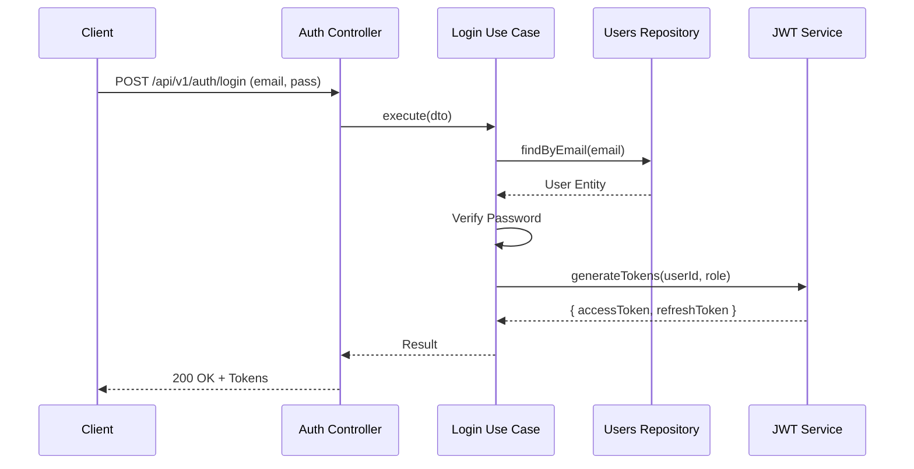

# Trivexa Backend - Mimari Kararlar (Architecture)

## Clean Architecture İzolasyonu

Trivexa Backend sistemi, bağımlılık kurallarını merkeze alan **Clean Architecture (Temiz Mimari)** ve **Domain Driven Design (DDD)** prensipleri ışığında tasarlanmıştır. Bu yaklaşımla birlikte her modül (örneğin `users`, `clients`, `finance`) tamamen bağımsız, kendi içinde kapalı (cohesive) ve dış bağımlılıkları minimize edilmiş olarak yapılandırılmıştır.

Her modülün altındaki standart dizin yapısı şöyledir:

- **`api/` (Presentation/Transport):** HTTP isteklerini karşılayan Controller, DTO (Data Transfer Objects) sınıfları ve WebSockets Gateway'ler. Bu katman kesinlikle business logic içermez, sadece gelen isteği validate eder ve Use-Case/Service katmanına aktarır.
- **`application/` (Business Rules):** İş kurallarının yer aldığı Use-Case senaryoları ve Application Servisleri yer alır. Ordu gibi DTO ve Domain Entity'lerini dönüştüren asıl yönetici kısımdır.
- **`domain/` (Enterprise Logic):** Veritabanından veya herhangi bir framework'ten bağımsız, işin kökünü oluşturan model tanımları (Entity arayüzleri) ve Domain Exceptions/Errors sınıf tanımlamaları yer alır.
- **`infrastructure/` (Data Access/External):** PostgreSQL'e özgü raw SQL Repository implementasyonları, harici SMS/Email servislerine ya da Redis'e atılan direkt çağrılar tam olarak burada konumlanır. Bu sayede DB teknolojisi (TypeORM vs Raw SQL) değişse bile _application_ ve _domain_ katmanları etkilenmez.
- **`public/` (Shared Contract):** Diğer modüllerin bu modül ile iletişim kurabilmesi için dışa açılmış interface ve enum'ları kapsar (örneğin Client modülünün, User modülünün interface'lerini çağırması gerekiyorsa Public katmanını kullanır).

## Sistem Mimarisi (System Architecture)

Aşağıdaki diyagram sistemin genel yüksek seviyeli bileşenlerini ve Clean Architecture akışını özetlemektedir:

## Bilgi Akişı: Kimlik Doğrulama (Sequence Diagram)

Kimlik doğrulama işlemi sırasındaki genel veri akışını gösteren bir dizi şeması (Sequence Diagram):

## Raw SQL ile Repository Pattern Kullanımı

Trivexa ekibi, ORM'lerin (Object-Relational Mapping - örn. TypeORM, Prisma) getirdiği ekstra soyutlama overhead'ini ve N+1 sorgu sorunlarını önlemek maksadıyla bilinçli olarak **TypeORM veya Prisma kullanmamıştır.**

- **PostgreSQL (`pg` paketi)** doğrudan `Pool` nesnesi kullanılarak `src/database/pool.ts` içinde yönetilmektedir.
- Her modülün `infrastructure` dizininde örneğin `users.repository.ts` yer alır ve SQL sorguları doğrudan bu repository içerisinde `.sql.ts` dosyalarından ya da template string'ler yardımıyla çalıştırılır.
- Güvenlik ve Injection risklerine karşı sorgular manuel parametrizasyon ile (Örn: `WHERE id = $1`) execute edilmektedir.

## Modüller Arası Etkileşim: Event-Bus (Pub/Sub)

Tight-coupling (sıkı bağlılığı) önlemek adına NestJS'in asenkron event özellikleri (`@nestjs/event-emitter` tabanlı) kullanılarak `EventBusModule` tasarlanmıştır.

- Örneğin bir Müşteri (Client) onaylandığında, doğrudan `NotificationsService` fonksiyonu çağrılmaz.
- Bunun yerine `ClientApprovedEvent` fırlatılır. `Notifications` modülü arka planda (asenkron olarak) bu etkinliği dinler ve e-mail gönderimini halleder.

## Konfigürasyon ve Environment Yönetimi

Uygulamanın ayarları (Environment Variables), global olarak yüklenmiş `ConfigModule` ve `src/config/` içerisindeki spesifik `registerAs()` yapısıyla yönetilir (örn: `databaseConfig`, `jwtConfig`, `redisConfig`). Bu sistem, env değişkenlerini uygulama içerisine statik string yerine kuvvetli tip (strongly-typed) kontrolleri ile almanızı sağlar (`src/config/env.validation.ts` ile Joi veya class-validator doğrulaması yapılır).

## İstisna (Exception) ve Yanıt (Response) Yapısı

Aşağıdaki iki Global Interceptor/Filter sayesinde Trivexa istemcileri daima kararlı bir JSON stili ile karşılaşır:

1. **`GlobalExceptionFilter`**: NestJS'in fırlattığı tüm hatalar (Unhandled exceptions, HttpExeptions veya Domain hataları) yakalanır. İstemciye `statusCode`, `timestamp`, `path`, ve `message` property'lerini içeren tek tip (uniform) bir hata dönülür.
2. **`ResponseInterceptor`**: Controller'dan çıkan saf veriler standart olarak `{ success: true, data: { ... } }` formatında sarılır (wrap).

## Güvenlik (Security)

- **Helmet:** HTTP header'ları güvenliği için ana `main.ts`'te aktiftir.
- **Throttler (Rate Limiting):** Brute-Force ataklarına karşı `ThrottlerGuard` tüm uygulama genelinde global aktif edilmiş olup `100 request / 60 seconds` olacak şekilde limitlenmiştir.
- **XssInterceptor:** Global seviyede eklenmiş olup, body/query üzerinden gelmesi muhtemel zararlı JavaScript kod veya Injection metinlerini temizler (Sanitization).
- **Audit Logging:** Platform içinde yapılan başarılı API mutasyonlarında (POST, PUT, PATCH, DELETE) sistem çapında logları DB'ye periyodik dökmek veya takip etmek adına `AuditInterceptor` devreye girmiştir. (Her kritik action `users_audit` vb. tablolara ya da ELK/Winston log yapısına beslenir).
