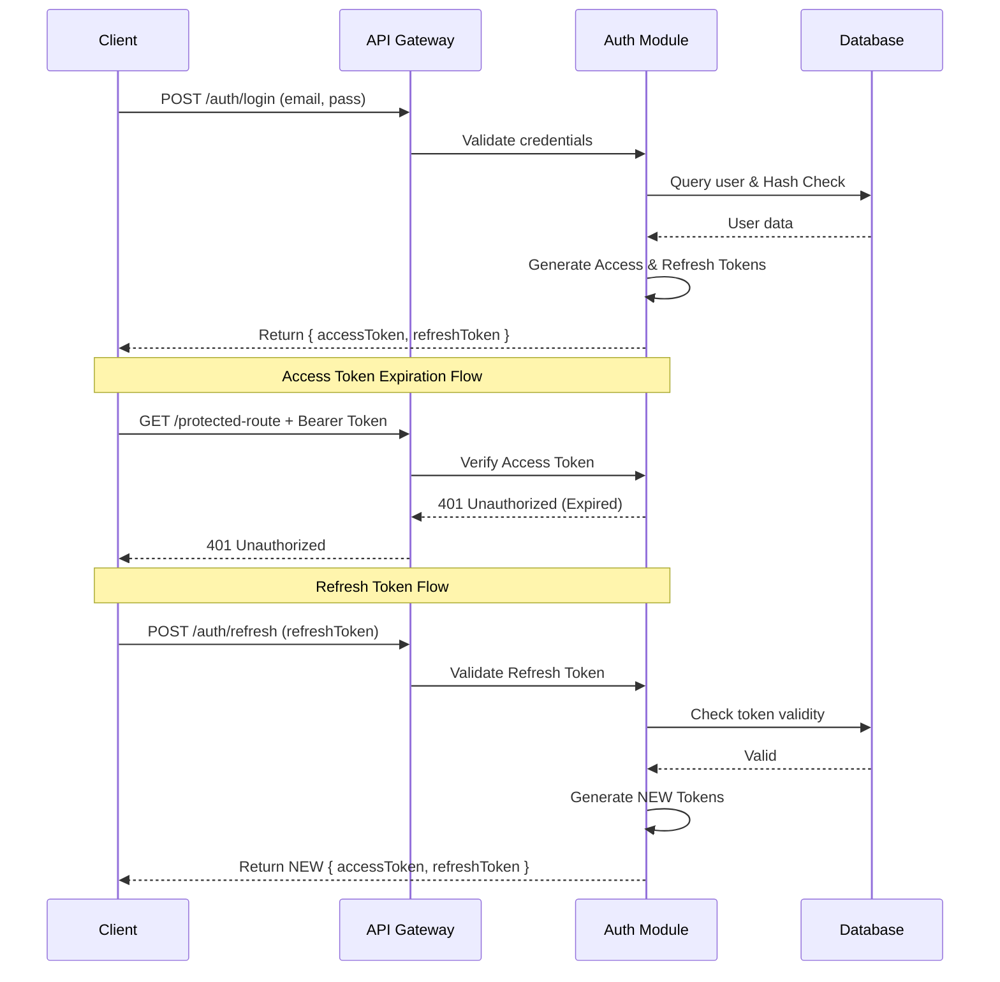

# Trivexa Backend - Kimlik Doğruluğu ve Yetkilendirme (AUTH)

Trivexa platformunun kimlik doğrulama mekanizması modern **JWT tabanlı (JSON Web Tokens)** ve **Çift Token'lı (Access + Refresh)** mimariyi kullanır. NestJS `@nestjs/passport` ve `passport-jwt` stratejileri sistemin kalbine entegre edilmiştir.

## 1. Authentication (Kimlik Doğrulama) Akışı

### A. Login & Token Üretimi

1. Kullanıcı `/auth/login` endpoint'ine e-posta ve şifresiyle istek atar (`LoginDto`).
2. İstek `AuthController` üzerinden Use-Case olan `LoginUseCase.execute` metoduna geçer.
3. Arka planda `UsersRepository` kullanılarak (Raw SQL ile) e-posta sorgulanır.
4. Şifre eşleşirse (bcrypt ile) `JwtService` kullanılarak iki ayrı payload imzalanır:
   - **Access Token:** Kullanıcının temel verilerini (id, role, department) taşıyan ve `JWT_ACCESS_EXPIRATION` (varsayılan: 15 dakika) süreyle geçerli kısa ömürlü imzalı jeton. İsteği doğrulayan asıl jetondur.
   - **Refresh Token:** Yeni bir Access Token alabilmek için gerekli, `JWT_REFRESH_EXPIRATION` (varsayılan: 7 gün) süreyle geçerli uzun ömürlü jeton.
5. Oluşturulan "Refresh Token", güvenlik sebebiyle sisteme "Plain Text" olarak KAYDEDİLMEZ. Bunun yerine SHA256 ile hashlenerek veritabanında kullanıcının id'si ile (`RefreshTokenRepository` aracılığıyla) cachelenir / saklanır.

### B. Session Restorasyonu (Refresh Flow)

Access Token'ın geçerliliği bittiği (401 Unauthorized alındığı) anda istemci (frontend):

- `/auth/refresh` endpoint'ine geçerli Refresh Token'ı yollar.
- Sunucu token'ı SHA256 ile hashlleyerek veritabanındaki (veya cache'teki) kayıt ile denkliğini sınar.
- Doğrulama geçerliyse istemciye güncel Access ve Refresh Token seti yeniden iletilir.

### C. Logout ve Token Kara Liste (Blacklist) Mekanizması

Güvenlik gereği JWT yapısı doğası gereği stateless (durumsuz) olsa da çıkış yapma (Logout) eylemlerinde Session'ı hemen öldürebilmek için "Kara Liste" yöntemi işler durumdadır.

- `/auth/logout` yapıldığında `AuthTokenRepository` kullanılarak JWT Access Token kara listeye kaydedilebilir (örn: Redis üzerine Expiration tarihiyle cachelenerek).
- Global olarak dinleyen `JwtStrategy`'nin `validate()` metodunda (`src/modules/auth/infrastructure/jwt.strategy.ts` içerisinde) `authTokenRepo.isBlacklisted(rawToken)` kontrolü yapılarak; token geçerli olsa bile kara listeye eklenmişse anında `UnauthorizedException('Token has been revoked')` hatası dönülür.

### D. Swagger UI Üzerinden Test (Swagger Authorization)

API dokümantasyonunda (Swagger UI) yetki gerektiren istekleri test etmek için:

1. `/auth/login` endpoint'i üzerinden geçerli kimlik bilgileriyle istek atarak `accessToken` değerini alın.
2. Ekranın sağ üst köşesindeki **"Authorize"** butonuna tıklayın.
3. Açılan alana Bearer formatına takılmadan doğrudan kopyaladığınız token'ı yapıştırıp onaylayın (Backend otomatik `Bearer` kelimesini işler).
4. Kilit ikonu kapalı hale geldiğinde yetkili istekleri test edebilirsiniz.

### E. Kimlik Doğrulama Veri Akışı (Token Flow)

---

## 2. Authorization (Yetkilendirme ve RBAC)

Projede kullanıcıları ayırmak bazında güçlü bir **Role-Based Access Control (RBAC)** devrededir. Kullanıcı nesnesinin `role` (Admin, Manager, Staff vs.) ve `department` kolonları yetkilendirmeyi şekillendirir.

### Guard'lar ve Dekoratörler

- **`@UseGuards(JwtAuthGuard)`**: Route'u yetkisiz (anonim) erişime kapatır. Request Header'ında geçerli Bearer token olmalıdır.
- **`@Roles('ADMIN', 'MANAGER')` ve `@UseGuards(RolesGuard)`**: JWT içindeki payload'da bulunan `user.role` bilgisini baz alarak, role dayalı erişim filtrelemesi uygular. Örneğin `InvoicesController` altındaki oluşturma endpointleri sadece ADMIN ve MANAGER rollerine açıktır.
- **`@CurrentUser()`**: Özel Custom NestJS decorator'ü, validasyon sonrası JWT payload'unu extract edip controller katmanına objeyi (`{ userId, email, role, department }`) temiz bir veri olarak direkt bind eder.

---

## 3. Client Access (Müşteri Modülü) Özel Girişleri

Müşteri kullanıcıları (Agentlik hizmeti alan şirketlerin paneline girecek kişiler) için özel "Magic Link" tarzı JWT akışları oluşturulabilmektedir.

- `ClientsController` altında yer alan `POST /clients/users/access-link` endpoint'i, müşteri paneline bir kerelik veya belirli süreli bir yetkilendirme linki fırlatabilir.
- Temel felsefesi ana personellerden (Staff/Admin) tamamen izole bir `ClientUser` tablosunda ve kimlik mekanizmasında barınmalarıdır. Bu da yetki karmaşalarının tamamen önüne geçer ve Tenant ayrımı sağlar.
