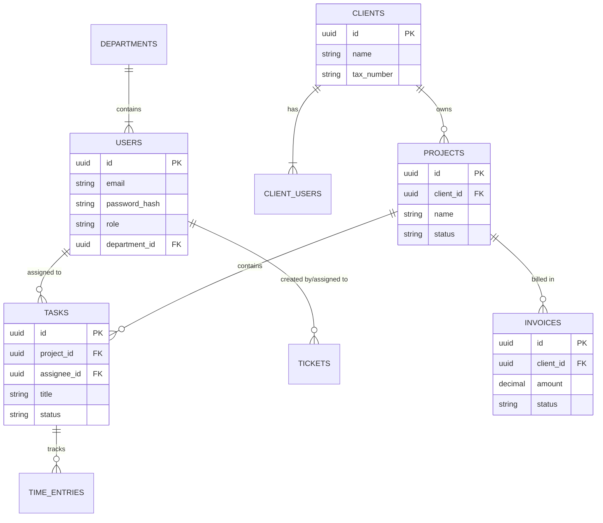

# Trivexa Backend - Veritabanı Yönetimi (DATABASE)

Trivexa platformu, katı sınırlarla (Clean Architecture) çevrelenmiş, yüksek ölçeklenebilir bir ilişkisel veritabanı strüktürüne dayanır. **En önemli mimari karar, herhangi bir ORM aracı (TypeORM, Prisma, Sequelize vb.) KULLANILMAMASI, bunun yerine doğrudan Raw SQL üzerinden Repository pattern çalıştırılmasıdır.**

## 1. Neden Raw SQL?

1. **Maksimum Performans ve İndeks Kontrolü:** ORM'lerin yarattığı siyah-kutu (blackbox) ve N+1 sorunlarından kurtularak, veritabanı sorgularının tam hakimiyeti geliştiriciye verilir.
2. **Kapsamlı Migration Kontrolü:** Şema, kodda tanımlanmış class'lardan senkronize edilmek (auto-sync) yerine, manuel olarak yazılan migration dosyaları üzerinden adım adım uygulanır ve geri alınır. Bu sayede canlı veritabanında "beklenmedik" tabloların veya sütunların uçması olaylarının önüne geçilir.
3. **Güvenlik (Parametrize Sorgular):** Tüm query'ler, `$1, $2` notasyonu kullanarak execute edilir. Bu, klasik ORM esneklikliğine yakınken, SQL Injection testlerinden %100 oranında pürüzsüz çıkan güvenli yapıyı sunar.

## 2. PostgreSQL ve `pg` Bağlantı Havuzu (Pool) Yöntemi

Mimaride veritabanı sunucusu tek bir kanal yerine bir "Bağlantı Havuzu (Connection Pool)" kullanılarak çağrılır.

- **`DatabasePool` Sınıfı:** `src/database/pool.ts` konumlandırdığı bu sağlayıcı `pg` modülünün yerleşik `Pool` sınıfını sarmalar (Wrap).
- `onModuleInit()`: NestJS kaldırıldığında, pool ayağa kalkar ve bağlantı hazır hale gelir.
- `onModuleDestroy()`: Uygulama kapatılırken pool kontrollü (graceful) şekilde sönümlenir.
- Configürasyon (Bağlantı max/min sayıları) `.env` üzerinden `DB_POOL_MAX` ve `DB_POOL_MIN` parametreleriyle projenin trafiğine göre anlık şekillenebilir.

## 3. Migration (Göç) Stratejisi

Veritabanı yapılandırmasını yönetmek için endüstri standardı olan **`node-pg-migrate`** tercih edilmiştir.

- Klasik Prisma/TypeORM aksine şema NestJS ile değil, doğrudan Node.js CLI'ı ile oluşturulan `.js/ts` dosyaları üzerinden veritabanına akar.
- Bir tablo ekleneceği zaman `package.json` içerisinde tanımlanan script'ler ile (`npm run migrate:create create-users-table` gibi) Up/Down bloklarına sahip saf SQL veya builder fonksiyonları içeren göç dosyaları yaratılır.

**Docker ile Entegrasyonu:**

- Production ayağa kalkarken Docker `Dockerfile` içerisindeki `entrypoint.sh` dosyasında NestJS başlatılmadan hemen önce `npm run migrate:up` tetiklenir. Uygulama hiçbir zaman database sürümü geride kalmış şekilde aktif olmaz.

## 4. Kullanılan Temel Tablolar ve Domain'ler (Özet Görünüm)

Veritabanı, Tenant (Müşteri) izolasyonuna göre katı anahtar (foreign primary keys) senaryolarıyla doludur:

- **`users` (`id`, `email`, `role`, `department_id`, ...):** Tüm dahili ajans personeli (Yönetici, Departman Elemanı).
- **`clients` (`id`, `name`, `tax_number`, ...):** Trivexa platformundan dış hizmet veya proje talep eden ana şirket hesapları (Tenant).
- **`client_users` (`id`, `client_id`, `email`, ...):** `Clients` şirketlerinin sisteme portal üzerinden giren yetkilileri. İşlemleri yalnızca kendi `client_id`'lerine daraltılmıştır.
- **`projects`, `tasks`, `tickets` vs:** Hem personellerin (`users`) hem de şirketlerin (`clients`) ilişkilendiği ortak takip alanları. Audit (Takip) logları için hepsinde `created_at`, `updated_at`, `created_by` gibi default standart kolonlar mecburidir.

