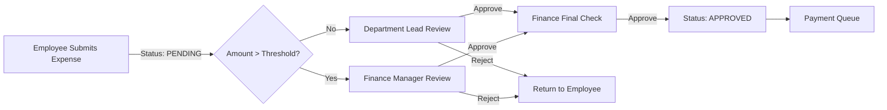

# Approval Workflows

Trivexa implements structured approval workflows to ensure financial and operational integrity.
These workflows apply to **Expenses**, **Time Entries**, **Contracts**, and critical **Tasks**.

## 1. Standard Approval Statuses

All approvable entities share a common status enum:

| Status | Description |
|:---|:---|
| `PENDING` | Initial state. Waiting for review. |
| `APPROVED` | Approved by the authorized person. Action proceeds. |
| `REJECTED` | Denied. Returned to the creator for correction or cancellation. |
| `CANCELED` | Withdrawn by the creator before review. |

## 2. Expense Approval Workflow

Used for reimbursing employee expenses or paying vendor bills.

### Rules
- **Threshold**: Expenses > $500 require Finance Manager approval immediately.
- **Self-Approval**: Managers cannot approve their own expenses.

## 3. Time Entry Approval Workflow

Used to bill clients for hours worked.

1.  **Submission**: Team member logs time (Status: `PENDING`).
2.  **Review (Weekly)**: Project Manager reviews entries for the week.
3.  **Action**:
    - **Approve**: Time is locked and ready for invoicing.
    - **Reject**: Entry is flagged with a comment. Member must correct duration or description.

## 4. Contract Approval Workflow

Used for client agreements.

1.  **Draft**: Account Manager prepares the contract (Status: `DRAFT`).
2.  **Legal Review**: Legal department checks terms (Status: `PENDING_LEGAL`).
3.  **Client Signature**: Sent to client (Status: `SENT`).
4.  **Active**: Client signs (Status: `ACTIVE`).

## 5. Implementation Strategy

### Database Schema
Approvable tables (`expenses`, `time_entries`) include:
- `status`: Enum (PENDING, APPROVED, REJECTED)
- `approver_id`: UUID (User who approved)
- `approved_at`: Timestamp
- `rejection_reason`: Text (Nullable)

### API Endpoints
- `POST /api/v1/{resource}/{id}/approve`
- `POST /api/v1/{resource}/{id}/reject`
    - Body: `{ "reason": "Receipt is blurry" }`
