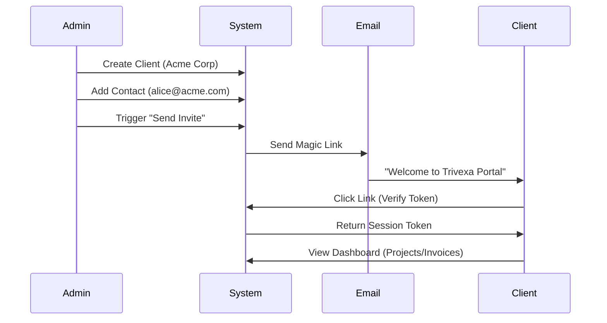

# Client Onboarding Process

This document outlines the end-to-end flow for bringing a new client into the Trivexa system.

## 1. Client Registration (Admin/Manager)
The process begins internally by an Agency Administrator or Account Manager.

1.  **Create Client Entity**:
    - Navigate to `Clients` section.
    - Click `New Client`.
    - Enter `Company Name`, `Tax ID`, `Address`.
    - Set Status to `ACTIVE`.

2.  **Add Contacts**:
    - Add primary contact person(s) (e.g., "John Doe", "john@client.com").
    - Assign roles (e.g., "Billing Contact", "Project Stakeholder").

## 2. Portal Access (Magic Link)
Clients do *not* have passwords by default. Access is granted via secure email links.

1.  **Send Invitation**:
    - Admin clicks `Send Access Invite` on the Client Contact profile.
    - System generates a unique, time-limited JWT (Magic Link Token).
    - Email is sent to the client via `NotificationsModule`.

2.  **Client Login**:
    - Client clicks the link in the email (`https://portal.trivexa.com/auth/verify?token=...`).
    - Frontend validates the token with Backend (`POST /api/v1/auth/client/login`).
    - Backend issues a session Access Token.

## 3. First Project Setup
Once the client is active:

1.  **Create Project**:
    - Manager creates a new project linked to the Client.
    - Define budget, start date, and scope.
  
2.  **Boarding**:
    - Manager adds `Project Members` (Agency Staff).
    - Manager can optionally invite Client Contacts as `Observers` to the project for transparency.

## 4. Financial Setup
1.  **Contract**:
    - Upload user service agreement.
    - Set billing terms (Net 30, Upfront, etc.).

2.  **First Invoice**:
    - Generate "Upfront Payment" invoice if applicable.
    - Send via Portal/Email.

## 5. Flow Diagram

