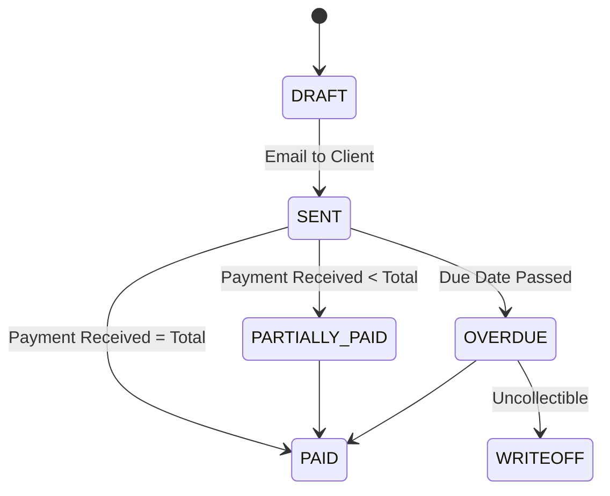

# Invoicing & Payment Process

This document details the financial workflow within Trivexa, from invoice generation to final payment reconciliation.

## 1. Invoice Lifecycle

Existing invoices flow through the following states:

### 1.1 Creation (Draft)
- **Manual**: Admin creates an invoice for ad-hoc services.
- **Automated**: System generates invoices from:
    - Approved Time Entries (Hourly projects).
    - Recurring Subscriptions (Retainers).
    - Project Milestones.

### 1.2 Sending
- **Method**: Email via `NotificationsModule`.
- **Content**: PDF attachment + Magic Link to Client Portal for online payment.

## 2. Payment Collections

Clients can pay via:
1.  **Online (Stripe/PayPal)**: Integrated via Client Portal.
2.  **Bank Transfer**: Admin manually records the transaction.

### Recording a Payment
When a payment is recorded:
1.  A `Payment` record is created linked to the `Invoice`.
2.  `Invoice.paid_amount` is updated.
3.  `Invoice.status` transitions to `PARTIALLY_PAID` or `PAID`.

## 3. Ledger Integration (Double-Entry)

Trivexa maintains a simplified **Double-Entry Ledger** to track financial health automatically.
Every financial action triggers a Ledger Entry.

### Scenario: Invoice Issued ($1,000)
| Account | Debit | Credit |
|:---|:---|:---|
| Accounts Receivable | $1,000 | |
| Sales Income | | $1,000 |

### Scenario: Payment Received ($1,000)
| Account | Debit | Credit |
|:---|:---|:---|
| Bank (Cash) | $1,000 | |
| Accounts Receivable | | $1,000 |

## 4. Automation & Reminders

- **Due Soon**: 3 days before due date -> Email reminder to Client.
- **Overdue**: 1 day after due date -> status update to `OVERDUE` + Email alert.
- **Late Fees**: (Optional) System can automatically append a late fee line item after X days.
