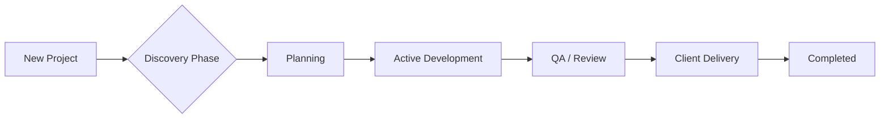

# Project & Task Workflow

This document details how projects are managed from inception to delivery within Trivexa.

## 1. Project Lifecycle

Projects move through the global status `ACTIVE`, `COMPLETED`, `ARCHIVED`.

### 1.1 Project Setup
1.  **Creation**: Project Manager creates project linked to a Client.
2.  **Team Assembly**:
    - **Resource Allocation**: Users added to `project_members`.
    - **Roles**: `MANAGER`, `DEVELOPER`, `DESIGNER`, `OBSERVER`.
3.  **Milestones**: Key deliverables are defined with dates (e.g., "MVP Launch", "Design Approval").

## 2. Task Management

Tasks are the atomic units of work, stored in `department_tasks`.

### 2.1 Task Hierarchy
- **Project**: Converting Website
    - **Milestone**: Homepage Redesign
        - **Task**: Create Wireframes (Assigned to: Alice)
        - **Task**: Implement React Components (Assigned to: Bob)
            - **Subtask**: Header
            - **Subtask**: Footer

### 2.2 Task Statuses

| Status | Description |
|:---|:---|
| `OPEN` | Backlog item. Not yet started. |
| `IN_PROGRESS` | Currently being worked on. |
| `REVIEW` | Work done. Awaiting internal QA or Manager approval. |
| `DONE` | Completed and verified. |
| `BLOCKED` | Cannot proceed due to external dependency. |

### 2.3 Dependencies
We support `Finish-to-Start` dependencies using `task_dependencies`.
*Example:* "Implement React Components" cannot start until "Create Wireframes" is `DONE`.

## 3. Progress Tracking

### 3.1 Personal Dashboard
Every user sees:
- **My Tasks**: Lists tasks assigned to them, sorted by Due Date.
- **Overdue**: Critical alerts for missed deadlines.

### 3.2 Gantt / Timeline
Project Managers view the project timeline based on `start_date`, `end_date`, and `task_dependencies`.

## 4. Automation

- **Status Propagation**: When all tasks in a Milestone are `DONE`, the Milestone progress becomes 100%.
- **Notifications**: Assignee gets email when:
    - Task is assigned.
    - Blocking task is completed.
    - Comment is added.
