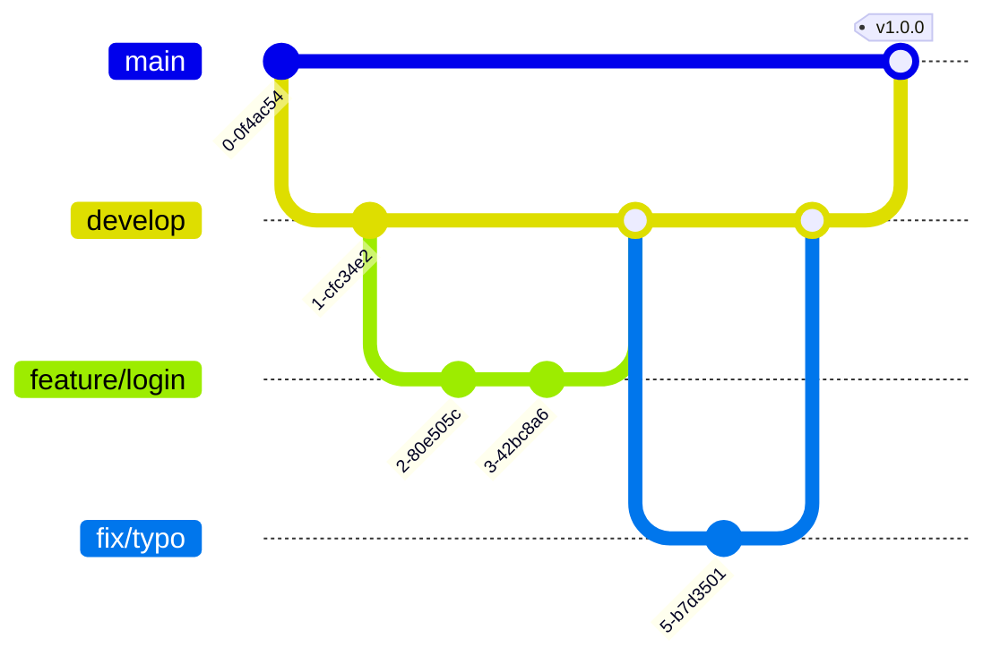

# Git Workflow Strategy

We use a simplified **Gitflow** model to manage development and releases.

## 1. Branching Strategy

| Branch | Protected? | Description |
|:---|:---|:---|
| `main` | **YES** | Production-ready code. Deploys to Prod. |
| `develop` | **YES** | Integration branch. Deploys to Staging. |
| `feature/*` | No | New features. Created from `develop`. |
| `fix/*` | No | Bug fixes. Created from `develop`. |
| `hotfix/*` | No | Critical production fixes. Created from `main`. |

### 1.1 Diagram

## 2. Commit Convention

We follow **Conventional Commits** (v1.0.0).

**Format**: `type(scope): description`

### Types
- `feat`: A new feature
- `fix`: A bug fix
- `docs`: Documentation only changes
- `style`: Changes that do not affect the meaning of the code (white-space, formatting)
- `refactor`: A code change that neither fixes a bug nor adds a feature
- `perf`: A code change that improves performance
- `test`: Adding missing tests or correcting existing tests
- `chore`: Changes to the build process or auxiliary tools

### Examples
- `feat(auth): implement jwt strategy`
- `fix(user): resolve null pointer in profile`
- `style: format code with prettier`
- `docs: update api endpoint description`

## 3. Pull Request (PR) Lifecycle

1.  **Draft**: Open a PR as soon as you start working (mark as Draft).
2.  **Review**: When ready, mark as Ready for Review.
3.  **CI Checks**: Ensure Github Actions (Lint/Test/Build) pass.
4.  **Approval**: Get at least 1 approval from a peer.
5.  **Merge**: Squash and Merge into `develop`.
