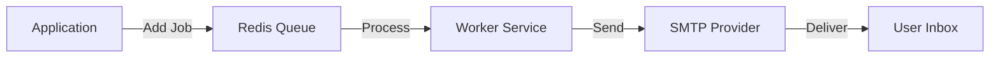

# Email Integration Strategy

Trivexa uses **Nodemailer** for sending transactional emails and **BullMQ** for queuing ensuring reliability and performance.

## 1. Architecture



### 1.1 Provider
We use **SMTP** to connect to email service providers.
- **Development**: [Ethereal Email](https://ethereal.email) or [Mailhog](https://github.com/mailhog/Mailhog).
- **Production**: AWS SES, SendGrid, or Postmark.

## 2. Implementation Details

### 2.1 Templates
We use **Handlebars (.hbs)** for dynamic HTML templates.
Located in: `src/modules/notifications/templates/`

**Example Template**: `welcome.hbs`
```html
<h1>Welcome, {{name}}!</h1>
<p>Click <a href="{{link}}">here</a> to verify your account.</p>
```

### 2.2 Queueing (BullMQ)
Sending emails is an I/O heavy operation and should **never** block the main thread.
All email requests are pushed to the `email` queue.

```typescript
// Producer
await this.emailQueue.add('send-welcome', { email: 'user@example.com', name: 'Alice' });

// Consumer
@Processor('email')
class EmailProcessor {
  @Process('send-welcome')
  async handle(job) {
    await this.mailer.sendMail({ ... });
  }
}
```

## 3. Key Email Types

| Type | Trigger | Priority |
|:---|:---|:---|
| **Welcome** | User Sign Up | High |
| **Reset Password** | User Request | Critical |
| **Invoice** | Billing Cycle | High |
| **Task Assignment** | Project Manager | Low (Batched) |

## 4. Error Handling

- **Retries**: Jobs are retried 3 times with exponential backoff if SMTP fails.
- **Dead Letter Queue (DLQ)**: Failed jobs are moved here for manual inspection.
