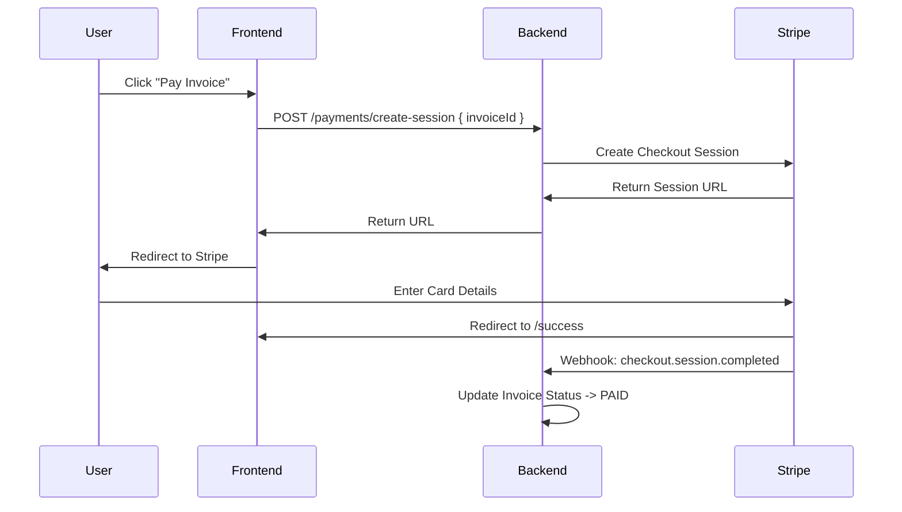

# Payment Gateway Integration Strategy

Trivexa integrates with **Stripe** and **PayPal** to accept client payments for invoices.

## 1. Supported Providers

| Provider | Use Case | Implementation |
|:---|:---|:---|
| **Stripe** | Credit Cards, ACH | Stripe Checkout (Hosted Page) |
| **PayPal** | PayPal Balance, Venmo | PayPal Standard Checkout |

## 2. Payment Flow

We use a **Redirect Flow** (Hosted Checkout) to minimize PCI compliance scope.



## 3. Webhooks

Webhooks are critical for confirming payment statuses asynchronously.

### 3.1 Security (HMAC)
All webhooks must be verified using the provider's signature.
- **Stripe**: `Stripe-Signature` header.
- **PayPal**: `Paypal-Transmission-Sig` header.

### 3.2 Handling Events
- **`payment_intent.succeeded`**:
    - Locate `Invoice` by metadata `invoice_id`.
    - Create `Payment` record in `payments` table.
    - Create `LedgerEntry` (Debit Bank / Credit AR).
    - Send "Receipt" email.
- **`payment_intent.payment_failed`**:
    - Notify Admin/Client.
    - Log failure reason.

## 4. Configuration

Environment variables required in `.env`:

```ini
STRIPE_SECRET_KEY=sk_test_...
STRIPE_WEBHOOK_SECRET=whsec_...
PAYPAL_CLIENT_ID=...
PAYPAL_CLIENT_SECRET=...
```

## 5. Testing

- **Stripe CLI**: Use `stripe trigger payment_intent.succeeded` to simulate webhooks locally.
- **Test Cards**: Use Stripe's `4242 4242...` card numbers.
